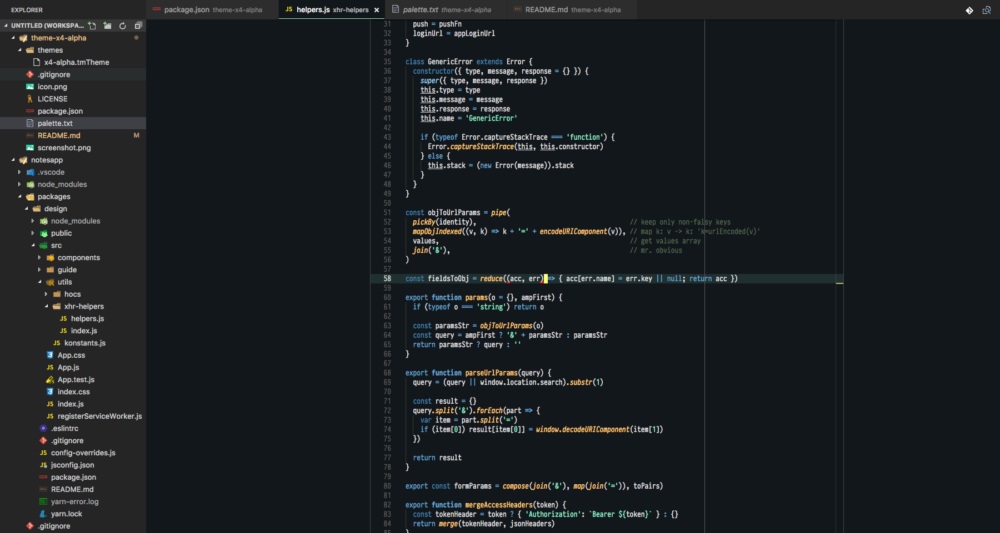

# x4-alpha VSCode Theme

A theme, very loosely based on the [x3-alpha VSCode Theme](https://github.com/gerane/VSCodeThemes).



I used the [following palette](palette.txt) in order to have 'correct' colors.

I focused on HTML/CSS/Javascript so other languages should be very broken.

This theme will be forever incomplete.

## The complete experience

Because the VSCode experience is more than just the used color theme, these are
are some of the VSCode settings I use.

```json
{
  "window.zoomLevel": 0,
  "workbench.editor.showIcons": true,
  "workbench.activityBar.visible": false,
  "workbench.editor.tabCloseButton": "right",
  "workbench.iconTheme": "vscode-icons",
  "workbench.editor.labelFormat": "short",
  "workbench.colorTheme": "x3-alpha",
  "workbench.editor.revealIfOpen": true,
  "search.location": "panel",
  "workbench.colorCustomizations": {
    "tab.activeBorder": "#93E5C0",
    "editor.selectionBackground": "#bbbbbb66",
    "editor.selectionHighlightBackground": "#bbbbbb66",
    "editor.wordHighlightBackground": "#bbbbbb66",
    "editorCursor.foreground": "#FFFF77",
    "editorError.foreground": "#ff0000",
    "editorOverviewRuler.errorForeground": "#ff0000",
    "editorWarning.foreground": "#fff500",
    "editorOverviewRuler.warningForeground": "#fff500",
    "editorInfo.foreground": "#00c0ff",
    "editorOverviewRuler.infoForeground": "#00c0ff",
    "peekViewEditor.matchHighlightBackground": "#32373B",
    "editorLineNumber.activeForeground": "#ccc"
  },

  "editor.cursorBlinking": "solid",
  "editor.cursorStyle": "block",
  "editor.renderIndentGuides": true,
  "editor.rulers": [80],
  "editor.fontFamily": "PragmataPro, monospace",
  "editor.fontLigatures": false,
  "editor.fontSize": 13,
  "editor.lineHeight": 17,
  "editor.renderLineHighlight": "all",
  "editor.minimap.enabled": false,
  "subtleBrackets.styles": {
    "global": {
      "borderWidth": "3px",
      "borderColor": "red",
      "borderStyle": "none none solid none"
    }
  }
}
```

## Credits

Forked from [Gerane x3-alpha](https://github.com/gerane/VSCodeThemes/tree/master/gerane.Theme-x3-alpha)

## More Information

* [Visual Studio Marketplace](https://marketplace.visualstudio.com/items/vvatikiotis.x4-alpha).
* [GitHub repository](https://github.com/vvatikiotis/theme-x4-alpha).
